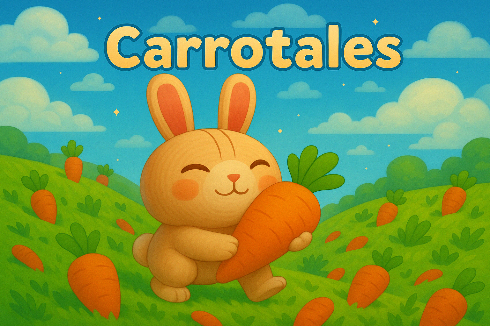

Jeu hébergé sur : https://shanto0o.github.io/3D-Game-Project-Carotales/

GitHub du projet : https://github.com/Shanto0o/3D-Game-Project-Carotales

Trailer : https://www.youtube.com/watch?v=VD92IOL5OIw

## Groupe
- **Florent Belot**
- **Shanti Noel**
- **Alexis Dubarry**
 
## Description
Carrotales est un jeu de plateforme 3D dans lequel vous incarnez un lapin aventurier. Vous êtes à la recherche de la récompense ultime : croquer la Carotte Sacrée. Pour cela, vous allez devoir parcourir différents niveaux, profiter du beau temps pour récolter des carottes et pêcher, et effectuer différentes quêtes qui vont ammeneront à votre rêve !

## Inspirations
Nous avons décidé de faire ce type de jeu car c'est ce que le thème nous inspirait : un monde paisible, où l'on peut se ballader et effectuer des quêtes. Nos principales inspirations pour ce jeu sont les jeux Animal Crossing ( pour l'aspect détente, mignon, avec un peu de temps à perdre à simplement changer d'apparence et regarder notre lapin tout mignon), et Stardew Valley (pour son système de pêche, et l'aspect "stressant" du jeu avec un temps qui passe, qui nous autorise à flaner mais dans un temps imparti).

## Niveaux
1. **Niveau 1** : île flottante avec une montagne. Deux chemins (facile / difficile) et deux mini-jeux : pêche et dés.
2. **Niveau 2** : apparition des ennemis (abeilles). Objectif : collecter des carottes et atteindre la fin avant la montre.
3. **Niveau 3** : la Carotte Sacrée est derrière un portail protégé par **4 cadenas**. Pour les ouvrir, 4 quêtes :
   - **Quête de pêche** : repêcher l’objet perdu du PNJ dans l’étang.
   - **Parcours chronométré** : finir un parcours en moins de 90 s.
   - **Récupération de clé** : explorer une grotte et rapporter la clé au PNJ.
   - **Combat de boss** : affronter une pinata, subir son explosion, ramasser les bonbons et les déposer pour terminer la quête.
   Une fois les 4 cadenas déverrouillés, le portail disparaît et vous accédez à la Carotte Sacrée.

## Modèles et animations 
- **Fait main!** : Nous avons réalisés nous-même presque tous les modèles de notre jeu (lapin, accessoires, mouton, Map de tous les niveaux), et toutes les animations ! 

## Personnalisation
Avant de démarrer la partie, vous pouvez personnaliser l’apparence de votre lapin en lui attribuant divers accessoires.

- **Bouton Personnaliser** : dans le menu principal, cliquez sur « Customize » pour ouvrir le panneau de personnalisation.
- **Sélection** : cochez la case de l’accessoire souhaité dans chaque catégorie.
- **Appliquer / Fermer** : cliquez sur « Appliquer » pour enregistrer vos choix, ou « Fermer » pour annuler.

## Commandes
- (jouable en qwerty)

## Visuels

**Quelques screenshot pris dans le jeu**

